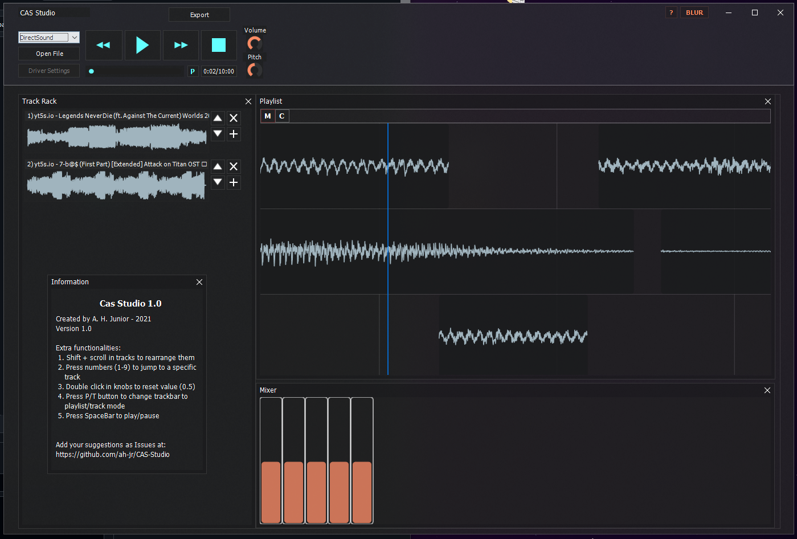

# OBS: Project still in the conceptualization phase, some of its core funcionalities were still not implemented.

# CAS-Studio
An audio editor built in Delphi that runs the CasEngine.
You can load multiple audio files and rearrange them in the playlist.

# How to compile
- Checkout the last synced version (vx.x). This is important for the dependencies to work properly.
- Clone [CAS-Engine v1.7](https://github.com/ah-jr/CAS-Engine) inside "deps\CasAudioEngine\".
- Clone [TAcrylicForm v1.4](https://github.com/ah-jr/TAcrylicForm) inside "deps\TAcrylicForm\".
- Open "src\CAS_Studio" and compile.

